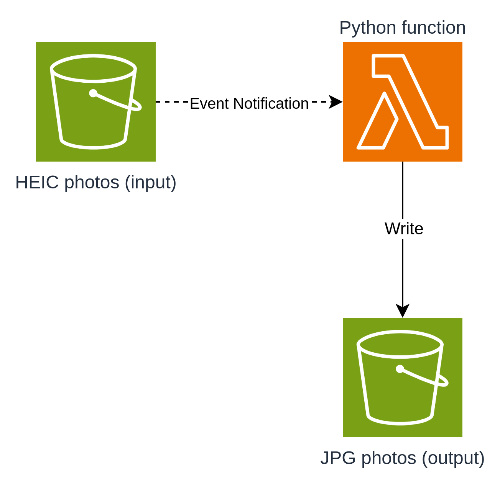

# heic-to-jpg

A serverless way to massively convert HEIC images to JPG almost instantaneously using S3 and Lambda.

I was helping my wife, who was trying to print some family photos, but the tool she was using only accepted JPG images, and most of her photos were in HEIC format.

Being the nerd that I am, I wasn't satisfied with just running a local Python script to convert all the photos. I thought: this is a great opportunity to practice creating a serverless application that does this. Using the power of cloud computing, I imagined it was possible to convert all the images almost instantaneously—and I did it!

I built a solution that uses S3 and Lambda to massively convert images.

Here's how I did it...

# The Solution



The idea is simple. S3 is an object storage service where I can store any type of file at a low cost. S3 has an interesting feature called "Event Notifications." With this feature, I can "listen" for different events that occur in a bucket (the location where I upload files).

So, for each file I upload, an event is triggered, which then handles the conversion to JPG. For the conversion, I use a Lambda function. Lambda is a Function-as-a-Service (FaaS) component that allows you to run code without worrying about infrastructure. It’s scalable and you only pay for what you use.

This same Lambda function saves the JPG image to another S3 bucket, where I can download it.

The cool thing is that the conversion happens almost instantaneously. That’s because both S3 and Lambda are serverless services, meaning they automatically scale as needed.

# How to use

To deploy this solution I'll need:
* An AWS account properly configured in our workspace
* Python 3.9
* Serverless Framework

Here is the step by step:

1. Install python dependencies
```bash
pip install -r requirements.txt
```

2. Deploy to AWS
```bash
sls deploy
```

3. Access your AWS Console, go to the S3 session and upload your HEIC photos to the "heic-input-*" bucket.

4. Go to the "jpg-output-*" bucket and download your converted files.

# Results

I was able to convert all the images for my wife in seconds by uploading the files through the S3 upload interface and downloading them from the S3 bucket.

The estimated cost for this is $0.000002293 per image converted.